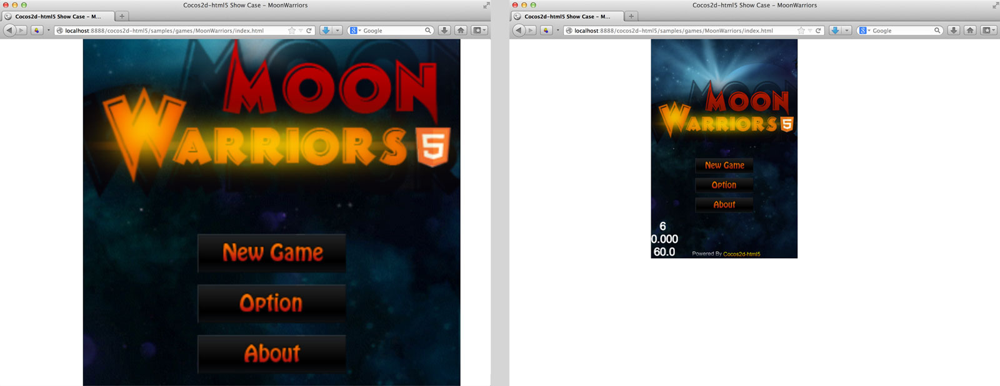
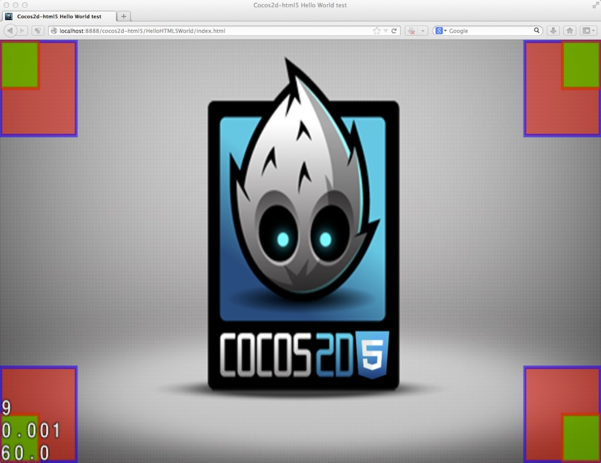

#Cocos2d-HTML5中的新屏幕适配方案

##关于屏幕适配

作为WEB开发者，相信大家都经历过跨平台多分辨率适配的痛。对于如何将网页的内容适配到不同尺寸的浏览器窗口，Responsive Design是目前非常热门的解决方案。可惜它不适用于Canvas中的游戏内容，所以Cocos2d-HTML5为游戏开发者提供了Resolution Policy解决方案。现在，在最新的2.2.2版本中，我们对它进行了重构，将它从Cocos2d-x的移植，变成了现在这样更适合网页游戏开发者的独特Resolution Policy解决方案。

这样的结果肯定不是我们想看到的...

这才像话，不过你也许也不满意，因为两条讨厌的白边，不用着急，我们也有你想要的。

现在就来看看使用新的Resolution Policy有多简单。

##使用方式

####1. 设置Resolution Policy

好吧，其实你什么也不用做，沿用之前版本的Resolution Policy设置代码就可以了。如果你还没有用过Resolution Policy，只需要在游戏载入过程完成之后（`applicationDidFinishLaunching`方法中或者之后），调用下面的代码：

>
	cc.EGLView.getInstance().setDesignResolutionSize(320, 480, cc.RESOLUTION_POLICY.SHOW_ALL);`

`setDesignResolutionSize`函数的前两个参数是你想要在你的代码中使用的游戏分辨率，第三个参数就是你选择的适配方案。引擎中内置了5种适配方案，每种都有自己独特的行为，详见下文。

2.2.2版中的重构主要是基于WEB端游戏与原生游戏的区别所设计。原生游戏中游戏总是使用全部屏幕空间，但是在WEB端你的网页中也许除了游戏还有别的视觉或文字元素，或者也许你需要给你的游戏设计一个漂亮的边框。所以Cocos2d-HTML5引擎的适配方案会默认适配游戏Canvas元素的父节点，如果你希望游戏场景适配浏览器屏幕，那么只需要将Canvas直接放置到body下就可以了：

>
	<body>
		<canvas id="gameCanvas"></canvas>
	</body>

####2. 监听浏览器的大小变化事件

新的适配方案允许在浏览器大小变化的时候自动重新尝试适配。比如说，当用户拖拽来改变浏览器大小，或者更有用的情况，当他们转动自己手机方向的时候。游戏中任意时刻都可以开启这种行为，只需要调用cc.EGLView的`resizeWithBrowserSize`函数：

>
	cc.EGLView.getInstance().resizeWithBrowserSize(true);

####3. Fullscreen API

[Fullscreen API](https://developer.mozilla.org/en-US/docs/Web/Guide/API/DOM/Using_full_screen_mode)是浏览器允许WEB页面在获得用户全屏幕的一个新的制定中的API。

Cocos2d-HTML5在移动端浏览器中会尝试自动进入全屏幕来给用户更好的游戏体验（需要指出并不是所有浏览器都支持这个API）。

另一方面，桌面端几乎所有现代浏览器都支持Fullscreen API，如果你希望使用这个API，Cocos2d-HTML5也简化了它的使用方式：

* 尝试进入全屏模式（需要用户交互）: `cc.Screen.getInstance().requestFullScreen();`
* 检测是否处于全屏模式: `cc.Screen.getInstance().fullScreen();`
* 退出全屏模式: `cc.Screen.getInstance().exitFullScreen();`

####4. Resolution Policy的意义

使用Resolution Policy的好处很明显，不论设备屏幕大小如何，也不论浏览器窗口的宽高比，你的游戏场景都会被自动放缩到屏幕大小。更重要的是，在游戏代码中，你将永远使用你所设计的游戏分辨率来布置游戏场景。比如说，如果你将设计分辨率设置为320 * 480，那么在游戏代码中你的游戏窗口右上角坐标将永远是(320, 480)。

##重要概念

####1. 游戏外框

游戏外框是你的游戏Canvas元素的初始父节点，一般情况下，它是html文档的`body`元素。但是如果你愿意，它可以是DOM结构中的任意容器节点。如果这个外框是`body`元素或者你设置了外框节点的大小，那么Canvas元素的初始大小就不重要了，屏幕适配过程中它会被自动放缩来适应外框大小。
再次提醒，如果你希望游戏窗口适应整个浏览器窗口，那么只需要将Canvas元素直接放在`body`下。

####2. 游戏容器

在Cocos2d-HTML5的初始化进程中，引擎会自动将你的Canvas元素放置到一个DIV容器中，而这个容器会被加入到Canvas的原始父节点（游戏外框）中。这个游戏容器是实现屏幕适配方案的重要辅助元素，你可以通过`cc.container`来访问它。

####3. 游戏世界

游戏世界代表游戏内使用的世界坐标系。

####4. 视窗

视窗是游戏Canvas元素的边界在游戏世界坐标系中的坐标及大小.

####5. 容器适配策略

容器适配策略负责对游戏容器和游戏Canvas元素进行放缩以适应游戏外框。

####6. 内容适配策略

内容适配策略负责将游戏世界放缩以适应游戏容器，同时也会计算并设置视窗。

##Predefined policies

Now I will introduce all five predefined policies, in each captured image, the red rects are the game's content corner, and the green ones are the corners of the viewport of your game: which equals to the canvas.

All resolution policies are combined with a container strategy and a content strategy, the combination of each policy is shown in the brackets.

####1. SHOW_ALL (PROPORTION_TO_FRAME + SHOW_ALL)

Show all policy will scale up the container to the maximum size in the frame which shows all your content on screen with the original width/height ratio you have set.

####2. NO_BORDER (EQUAL_TO_FRAME + NO_BORDER)

No border policy will scale proportionally the container so that it fills up the entire frame. In this case, if the width/height ratio of the frame doesn't equal to your designed ratio, some area of your game will be cut off.

####3. EXACT_FIT (EQUAL_TO_FRAME + EXACT_FIT)

Exact fit policy will scale the container to fit exactly the frame, so your game's w/h ratio will probably lost.

####4. FIXED_WIDTH (EQUAL_TO_FRAME + FIXED_WIDTH)

Fixed width policy will scale the width of the container to fit the frame's width, and the height will be scaled proportionally.

Pay attention to the position of viewport corners, it's different from the show all policy.

####5. FIXED_HEIGHT (EQUAL_TO_FRAME + FIXED_HEIGHT)

Fixed height policy will scale the height of the container to fit the frame's height, and the width will be scaled proportionally.

In the case of our caption, the game width is larger than the game height, so the FIXED_WIDTH policy act like SHOW_ALL, and the FIXED_HEIGHT policy act like NO_BORDER. On the contrary, if the game width is smaller than the game height, the FIXED_WIDTH policy will act like NO_BORDER, and the FIXED_HEIGHT policy will act like SHOW_ALL.

##Customized resolution policy

####1. Combien predefined strategies

As you can see, the predefined policies just uses the combination of predefined strategies, you can do the same thing also. The predefined strategies are listed below:

- Container strategies
	- cc.ContainerStrategy.EQUAL_TO_FRAME
	- cc.ContainerStrategy.PROPORTION_TO_FRAME
	- cc.ContainerStrategy.ORIGINAL_CONTAINER

- Content strategies
	- cc.ContentStrategy.SHOW_ALL
	- cc.ContentStrategy.NO_BORDER
	- cc.ContentStrategy.EXACT_FIT
	- cc.ContentStrategy.FIXED_WIDTH
	- cc.ContentStrategy.FIXED_HEIGHT

To construct and use a resolution policy with strategies, you should do the following:
>
	var policy = new cc.ResolutionPolicy(cc.ContainerStrategy.PROPORTION_TO_FRAME, cc.ContentStrategy.EXACT_FIT);
	cc.EGLView.getInstance().setDesignResolutionSize(320, 480, policy);

This policy should work exact like the show all policy.

####2. Implement your own strategy

If you are not satisfied with our predefined strategies, you can even implement your own strategy to fit whatever you need.

Extend the container strategy:
>
	var MyContainerStg = cc.ContainerStrategy.extend({
		init: function (view) {
			// This function is called once cocos2d-html5 initiated, 
			// you can remove this function if you don't need any initialization
		},
>
		apply: function (view, designedResolution) {
			// Apply process
		}
	});

Extend the content strategy
>
	var MyContentStg = cc.ContentStrategy.extend({
		apply: function (view, designedResolution) {
			var containerW = cc.canvas.width, containerH = cc.canvas.height;
>			
			// The process to calculate the content size, the x axe scale and the y axe scale
>
			return this._buildResult(containerW, containerH, contentW, contentH, scaleX, scaleY);
		}
	});

At last, you should construct your own policy with your custom strategies.
>
	var policy = new cc.ResolutionPolicy(new MyContainerStg(), new MyContentStg());
	cc.EGLView.getInstance().setDesignResolutionSize(320, 480, policy);

If you want more details of the new resolution policy implementation, you can refer to the source code of CCEGLView.js or our [github repository](https://github.com/cocos2d/cocos2d-html5/blob/develop/cocos2d/core/platform/CCEGLView.js)